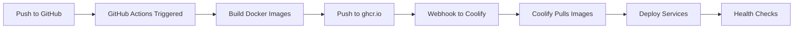

# GitHub + Coolify Integration Guide for Archon

This guide will help you set up automatic deployments from GitHub to Coolify for your Archon stack.

## 📋 Prerequisites

- GitHub repository with your Archon code
- Coolify instance with your Supabase stack running
- GitHub account with Actions enabled
- Access to Coolify admin panel

## 🚀 Quick Setup

### Step 1: Configure GitHub Repository

1. **Enable GitHub Packages (Container Registry)**:
   - Go to your GitHub repository Settings
   - Navigate to "Actions" → "General"
   - Under "Workflow permissions", select "Read and write permissions"
   - Check "Allow GitHub Actions to create and approve pull requests"
   - Save changes

2. **Add Repository Secrets**:
   Go to Settings → Secrets and variables → Actions, and add:
   ```
   COOLIFY_WEBHOOK_URL    # Your Coolify webhook URL
   COOLIFY_APP_URL        # Your deployed app URL (for health checks)
   ```

### Step 2: Configure Coolify

1. **Create a New Application in Coolify**:
   - Go to your Coolify dashboard
   - Click on your project
   - Add New → Docker Compose

2. **Configure Source**:
   ```yaml
   Source Type: Docker Compose
   Repository: Public Repository
   Repository URL: https://github.com/YOUR_USERNAME/archon
   Branch: main
   Docker Compose Location: /docker-compose.coolify.yml
   ```

3. **Set Up Webhook**:
   - In Coolify, go to your application settings
   - Find "Webhooks" section
   - Copy the webhook URL
   - Add it as `COOLIFY_WEBHOOK_URL` in GitHub Secrets

4. **Configure Environment Variables in Coolify**:
   ```bash
   # Your existing Supabase configuration
   SUPABASE_URL=https://supabase.v1su4.com
   SUPABASE_SERVICE_KEY=your-service-key
   
   # GitHub Registry Configuration
   GITHUB_REPOSITORY=YOUR_USERNAME/archon
   GITHUB_SHA=latest  # Will be updated by GitHub Actions
   
   # Service Ports
   ARCHON_UI_PORT=3737
   ARCHON_SERVER_PORT=8181
   ARCHON_MCP_PORT=8051
   ARCHON_AGENTS_PORT=8052
   
   # Host Configuration
   HOST=your-domain.com
   
   # Optional: AI Provider
   OPENAI_API_KEY=your-openai-api-key
   
   # Logging
   LOG_LEVEL=INFO
   ```

### Step 3: Set Up GitHub Actions

The workflow file (`.github/workflows/deploy-coolify.yml`) is already created and will:

1. **Build Docker images** for all services
2. **Push to GitHub Container Registry** (ghcr.io)
3. **Trigger Coolify deployment** via webhook
4. **Run health checks** after deployment

### Step 4: Configure Docker Registry in Coolify

1. **Add GitHub Container Registry**:
   - Go to Coolify Settings → Docker Registries
   - Add New Registry:
     ```
     Name: GitHub Container Registry
     URL: ghcr.io
     Username: YOUR_GITHUB_USERNAME
     Password: YOUR_GITHUB_PERSONAL_ACCESS_TOKEN
     ```

2. **Create GitHub Personal Access Token**:
   - Go to GitHub Settings → Developer settings → Personal access tokens
   - Generate new token (classic) with scopes:
     - `read:packages`
     - `write:packages`
     - `delete:packages` (optional)

### Step 5: Deploy

1. **Initial Manual Deployment**:
   ```bash
   # Push your code to trigger the workflow
   git add .
   git commit -m "Setup GitHub Actions for Coolify deployment"
   git push origin main
   ```

2. **Monitor Deployment**:
   - Check GitHub Actions tab for build progress
   - Monitor Coolify logs for deployment status
   - Verify services are running

## 🔄 Continuous Deployment Flow



## 🛠️ Advanced Configuration

### Using Build Arguments

Add build arguments in your workflow:
```yaml
build-args: |
  BUILDKIT_INLINE_CACHE=1
  NODE_ENV=production
```

### Multi-Environment Setup

Create separate workflows for different environments:
- `.github/workflows/deploy-staging.yml`
- `.github/workflows/deploy-production.yml`

### Custom Health Checks

Add comprehensive health checks in the workflow:
```yaml
- name: Comprehensive Health Check
  run: |
    # Check all services
    curl -f ${{ secrets.COOLIFY_APP_URL }}:3737 || exit 1
    curl -f ${{ secrets.COOLIFY_APP_URL }}:8181/health || exit 1
    curl -f ${{ secrets.COOLIFY_APP_URL }}:8051/health || exit 1
    curl -f ${{ secrets.COOLIFY_APP_URL }}:8052/health || exit 1
```

## 📊 Monitoring

### GitHub Actions Status Badge

Add to your README.md:
```markdown
[](https://github.com/YOUR_USERNAME/archon/actions/workflows/deploy-coolify.yml)
```

### Coolify Monitoring

- Check deployment logs in Coolify
- Monitor container health status
- Set up alerts for failed deployments

## 🚨 Troubleshooting

### Common Issues

1. **Build Failures**:
   - Check GitHub Actions logs
   - Verify Dockerfile paths are correct
   - Ensure all dependencies are in requirements files

2. **Registry Authentication**:
   - Verify GitHub token has correct permissions
   - Check registry configuration in Coolify
   - Ensure images are public or Coolify has access

3. **Webhook Not Triggering**:
   - Verify webhook URL is correct
   - Check Coolify webhook logs
   - Ensure GitHub Actions can reach Coolify

4. **Services Not Starting**:
   - Check Coolify application logs
   - Verify environment variables are set
   - Check port conflicts

### Debug Commands

```bash
# Check if images are pushed to registry
docker pull ghcr.io/YOUR_USERNAME/archon-server:latest

# Test webhook manually
curl -X POST YOUR_COOLIFY_WEBHOOK_URL \
  -H "Content-Type: application/json" \
  -d '{"test": true}'

# Check service logs in Coolify
docker logs archon-server
docker logs archon-mcp
docker logs archon-agents
docker logs archon-ui
```

## 🔐 Security Best Practices

1. **Never commit secrets** to the repository
2. **Use GitHub Secrets** for sensitive data
3. **Rotate tokens regularly**
4. **Use least privilege** for service accounts
5. **Enable 2FA** on GitHub and Coolify
6. **Audit logs** regularly

## 📝 Maintenance

### Updating Services

1. Make changes to your code
2. Push to GitHub
3. GitHub Actions automatically builds and deploys
4. Coolify performs rolling updates

### Database Migrations

For database changes:
1. Update `migration/complete_setup.sql`
2. Run migrations manually in Supabase
3. Deploy application updates

### Rollback Strategy

If deployment fails:
1. Use Coolify's rollback feature
2. Or redeploy previous GitHub commit:
   ```bash
   git revert HEAD
   git push origin main
   ```

## 📚 Additional Resources

- [Coolify Documentation](https://coolify.io/docs)
- [GitHub Actions Documentation](https://docs.github.com/en/actions)
- [GitHub Container Registry](https://docs.github.com/en/packages/working-with-a-github-packages-registry/working-with-the-container-registry)
- [Archon Documentation](./README.md)

## 🆘 Support

If you encounter issues:
1. Check the troubleshooting section
2. Review Coolify and GitHub Actions logs
3. Open an issue in the Archon repository
4. Join the community Discord for help
